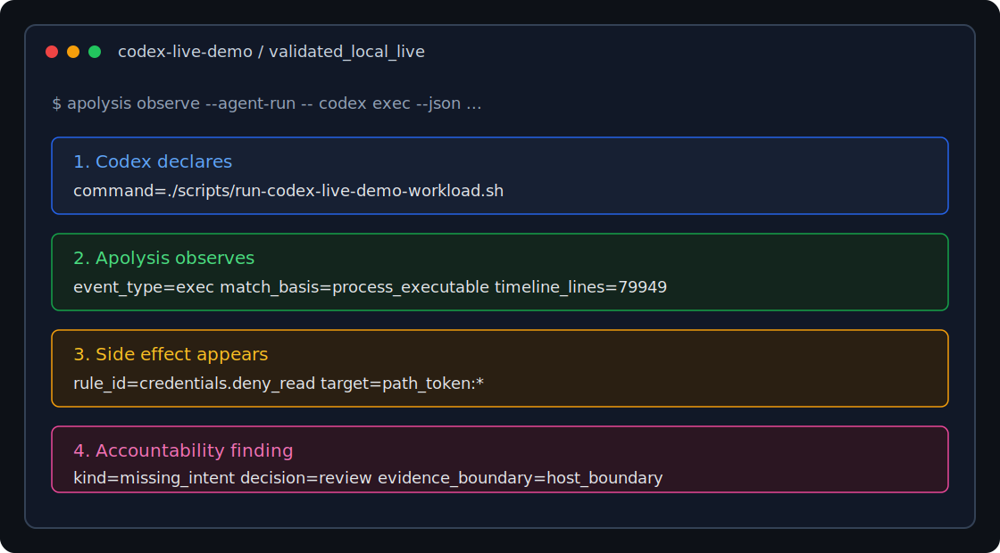

# Apolysis

[](https://github.com/0xLaiHo/Apolysis/actions/workflows/release-validation.yml)
[](https://github.com/0xLaiHo/Apolysis/releases)
[](LICENSE)

[English](README.md) | [简体中文](README.zh-CN.md)

**30 秒摘要：**Apolysis 是面向 AI agent workload 的环境侧飞行记录仪。它记录
一次 agent session 在 Linux 上实际做了什么，并把主机侧进程、文件、网络、凭证、
runtime 和声明意图证据关联为可审计 records，供团队独立于 agent harness 复查。

**Demo 状态：**P1 demo starter 资产已放在
[`docs/codex-intent-mismatch-demo.md`](docs/codex-intent-mismatch-demo.md)。
它通过 fixture 复现 Codex run 中声明意图与主机侧证据的对比，并把一次意外的假凭证
读取归结为 `missing_intent` finding。真实录制流程已放在
[`docs/codex-live-demo-runbook.md`](docs/codex-live-demo-runbook.md)。privileged
live path 已在本地验证，脱敏后的公开摘录已放在
[`docs/codex-live-demo-public-assets.md`](docs/codex-live-demo-public-assets.md)。
第一版静态 launch visual 和英文 write-up 已可用；最终公开首发用的 asciinema/GIF
仍在计划中。



Launch write-up:
[`Apolysis: A Flight Recorder For AI Coding Agents`](docs/blog/apolysis-flight-recorder-for-ai-coding-agents.md)。

Apolysis 是一个面向 AI Agent workload 的 Linux 运行时问责层。它在 agent
harness 之下采集由环境拥有者掌握的证据，将这些证据与声明意图和 runtime metadata
关联起来，并写入可独立审计的 audit records。

Apolysis 适合运行 coding agent、自动化 agent 或不可信生成代码的团队。它要回答的问题很直接：
这个 session 在主机或 runtime 上实际做了什么？

## 为什么需要 Apolysis

Agent harness 日志有价值，但不能作为完整事实来源。Harness 可能隐藏重试、启动子进程、通过插件路由工具、处理凭证，或者在较宽松的文件系统和网络权限下运行。Apolysis 将证据边界放在 harness 之外。

Apolysis 聚焦三类职责：

- 将进程、文件、网络、runtime 和 policy evidence 记录到 append-only JSONL timeline。
- 将本地进程、Docker container、Kubernetes metadata 和 runtime isolation signal 关联到同一个 agent session。
- 提供 policy decision 和 operator feedback，同时不夸大 runtime 实际能够执行的控制能力。

Apolysis 不是 Docker、gVisor、Kata Containers、Firecracker、Kubernetes、MCP gateway
或审批 UI 的替代品。它补充这些系统，从环境视角记录 side effects 和 runtime context。

## 核心能力

- 本地命令 wrapper，跟踪 session 从进程启动到退出的完整过程。
- Docker runtime adapter，包含保守默认值、labels、resource limits 和 container metadata capture。
- Fixture 和 live eBPF observer backend，用于 process、有界 exec argv、file、network
  和 credential-related events。
- Policy evaluation，支持 `Notify`、`Review`、`Kill`，并在 kernel support 不可用时显式降级 `Block` 行为。
- Kubernetes 和 Agent Sandbox metadata parsing，覆盖 Pod、namespace、RuntimeClass、service account 和 node context。
- Strong-isolation visibility assessment，用于 host-side evidence 无法覆盖 guest semantics 的 runtime。
- Node-local daemon、health model、metrics、recovery checks 和 Kubernetes deployment assets。
- 面向 regulated environment 的 evidence packaging、retention、signing、registry 和 release-readiness validation scripts。

## 架构

Apolysis 将 intent、isolation 和 evidence 分成三层：

- Intent authorization：agent 或 operator 声明应该发生什么。
- Execution isolation：runtime 允许 workload 触及什么。
- Side-effect verification：OS 和 runtime 显示实际发生了什么。

仓库拆分为多个职责清晰的 Rust crates：

- `apolysis-cli`：运行和观测 session 的命令行入口。
- `apolysis-core`：共享 schema 和 JSONL record 类型。
- `apolysis-runtime`：本地和 Docker runtime adapters。
- `apolysis-observer`：fixture 和 live observer backends。
- `apolysis-policy`：policy parser 和 decision logic。
- `apolysis-store`：append-only JSONL writer 和 hash-chain support。
- `apolysis-kubernetes`：Kubernetes 和 Agent Sandbox metadata parsing。
- `apolysis-visibility`：strong-isolation visibility assessment。
- `apolysis-accountability`：session、finding、queue 和 health contracts。
- `apolysis-daemon`：node-local Unix socket service。
- `apolysis-feedback`：面向 agent 的 feedback files。

版本化 JSONL record contract 见
[`docs/jsonl-schema-v1.md`](docs/jsonl-schema-v1.md)。

## 环境要求

- Linux development host。
- Rust stable toolchain 和 Cargo。
- Docker runtime execution 需要 Docker CLI 和 daemon。
- Live eBPF observation 需要 `clang`、`llvm-strip`、`bpftool`、kernel BTF，以及所需 Linux capabilities 或 root 权限。

大多数 unit 和 fixture tests 不需要 root。

## Release Artifacts

带 tag 的 release 会附带 Linux artifact bundle，包含 `apolysis` CLI、CO-RE
`apolysis_observer.bpf.o` object、release manifest、独立 SHA-256 checksum，以及
由 retained F6 signing evidence 生成的 release-signing evidence：

在发布新的 demo 或 release 之前，先运行
[`Release Artifact Dry Run`](docs/release-artifact-dry-run.md)，验证 workflow
可以构建并上传 artifact bundle，同时不修改公开 GitHub Release。

```bash
version=v0.2.0
target=x86_64-unknown-linux-gnu
asset="apolysis-${version}-${target}.tar.gz"

gh release download "$version" \
  --repo 0xLaiHo/Apolysis \
  --pattern "$asset*" \
  --pattern apolysis-release-manifest.json \
  --pattern apolysis-release-signing-manifest.json \
  --pattern apolysis-release-signing-evidence.json \
  --pattern apolysis-regulated-release-signing-evidence-report.json

sha256sum -c "$asset.sha256"
sha256sum apolysis-release-manifest.json
tar -xzf "$asset"
```

`apolysis-release-signing-manifest.json` 会记录被 retained regulated-release
signing evidence 覆盖的 `apolysis-release-manifest.json` SHA-256。缺少 signing
manifest、hash 不匹配，或 `release_signing_ready:false` 都应视为 unsigned
release。

解包后，在 live observation 中使用 bundle 内的 BPF object：

```bash
sudo -E "./apolysis-${version}-${target}/bin/apolysis" observe \
  --backend live \
  --session codex-local-audit \
  --policy policies/local-dev.yaml \
  --output .apolysis/codex-live/timeline.agent-run.jsonl \
  --bpf-object "./apolysis-${version}-${target}/ebpf/apolysis_observer.bpf.o" \
  --workspace-root "$PWD" \
  --agent-kind codex \
  --agent-run -- codex resume <codex-session-id>
```

## 编译

编译整个 workspace 和 eBPF object：

```bash
make build
```

只编译 eBPF object：

```bash
make build-ebpf
```

格式化和 lint：

```bash
cargo fmt --all
make lint
```

## 测试

运行默认 Rust test suite：

```bash
make test
```

在已准备好 eBPF 能力的主机上运行 live observer smoke test：

```bash
make test-live
```

Production 和 release validation scripts 通过 Make targets 暴露，适合需要显式 evidence gates 的 operator workflow 和 CI job。无密钥 handoff gate 会检查 release-validation runbook 和 roadmap 状态是否仍保持一致；preflight fixture gate 会检查 retained evidence readiness report 和 evidence index 生成路径；CI contract gate 会检查 release-validation GitHub Actions workflow 保持 repo-local、不需要 credentials，并保留稳定 evidence artifacts：

```bash
make test-release-validation-handoff
make test-release-validation-preflight
make test-release-validation-ci
```

## 生产使用示例

当你希望把 Apolysis 作为由 operator 掌握的 evidence layer 包在真实 agent
workload 外侧时，可以直接使用下面这些示例。生成的 timeline 和验证报告应放在被
ignore 的 `.apolysis/` 或 `target/` 路径下。不要提交这些输出、kubeconfig、
provider credentials、signing material 或包含 private workload data 的捕获内容。

### 审计本地 agent 命令

当你希望由 Apolysis 启动本地 coding agent，并由 Apolysis 掌握被观测 root PID
时，使用这个 live observer 模式。Operator 不再需要运行 `ps`，也不需要在多个
Codex process 中手动选择 PID；`--agent-run -- <command>` 会在 live observer 下
启动 agent，并把 supervisor metadata 写入 timeline。Managed launch 会在 attach
前用 agent root、线程和可发现 descendants seed process-tree scope。对 managed
launch 来说，`--duration-seconds` 是上限；如果 agent 更早结束，observer 会 drain
并记录 agent exit metadata。

```bash
mkdir -p .apolysis/codex-live

sudo -E ./target/debug/apolysis observe \
  --backend live \
  --session codex-local-audit \
  --policy policies/local-dev.yaml \
  --output .apolysis/codex-live/timeline.agent-run.jsonl \
  --output-max-bytes 104857600 \
  --output-max-files 8 \
  --bpf-object target/ebpf/apolysis_observer.bpf.o \
  --workspace-root "$PWD" \
  --agent-kind codex \
  --agent-run -- codex resume <codex-session-id>
```

`--output-max-bytes` 和 `--output-max-files` 用于限制本地 JSONL 增长。当 active
timeline 即将超过字节预算时，Apolysis 会把 `timeline.agent-run.jsonl` 轮转为
`timeline.agent-run.jsonl.1`，并顺延更早的归档，同时写入
`observer-output-rotation` metadata，记录 `max_file_bytes` 和
`max_archived_files`。单条 JSONL record 不会被拆到多个文件里。

### 验证已导出的 daemon timeline

从节点上复制 daemon session timeline 之后，可以用只读 hash-chain verifier
验证 evidence，不会修改源文件：

```bash
./target/debug/apolysis verify hash-chain \
  --input /var/lib/apolysis/sessions/<session-id>/timeline.jsonl \
  --output target/hash-chain-verification/<session-id>.report.json
```

timeline 有效时命令退出 `0`；验证失败但 report 已写出时退出 `1`；参数错误、
输入文件不可读等无法执行的情况退出 `2`。Report 包含 `record_count`、
`last_sequence`、`last_record_hash`、`valid_bytes`、`total_bytes` 和
`failure`。

如果 agent 已经由另一个可信 supervisor 启动，不要让 operator 按进程名手动选择
PID；应由该 supervisor 写出显式 registration file：

```json
{
  "agent_kind": "codex",
  "pid": 12345,
  "start_time_ticks": 987654321,
  "workspace_root": "/srv/agents/repo",
  "executable": "/home/agent/.nvm/versions/node/bin/codex",
  "command_fingerprint": "sha256:<hex>",
  "command": "codex resume <codex-session-id>"
}
```

然后用 registration file attach。Apolysis 会在 attach 前比较记录的
`start_time_ticks` 和 `/proc/<pid>/stat`，如果 PID 已被复用则 fail closed：

```bash
sudo -E ./target/debug/apolysis observe \
  --backend live \
  --session codex-local-audit \
  --policy policies/local-dev.yaml \
  --output .apolysis/codex-live/timeline.agent-registration.jsonl \
  --bpf-object target/ebpf/apolysis_observer.bpf.o \
  --workspace-root "$PWD" \
  --agent-registration .apolysis/codex-live/agent-registration.json
```

本地排障可使用 diagnostic-only discovery fallback：
`--agent-kind codex --agent-discover`。它会按 agent kind、workspace、session id、
executable path、command line 和 parent chain 给候选进程打分；只要仍有多个候选，
就拒绝 attach。

查看生成的 timeline：

```bash
wc -l .apolysis/codex-live/timeline.agent-run.jsonl

jq -c 'select(.resource=="agent-supervisor-mode" or .resource=="agent-kind" or .resource=="agent-root-pid" or .resource=="agent-command" or .resource=="agent-command-fingerprint" or .resource=="observer-scope")' \
  .apolysis/codex-live/timeline.agent-run.jsonl

jq -r '.event_type // .event_name // .kind // .record_type' \
  .apolysis/codex-live/timeline.agent-run.jsonl | sort | uniq -c

jq -c 'select(.event_type=="network_connect" or .event_type=="process_exit" or .event_name=="connect")' \
  .apolysis/codex-live/timeline.agent-run.jsonl

jq -c 'select(.event_type=="exec" or .event_name=="sched_process_exec") | {record_type,event_name,event_type,pid,actor,resource,raw_payload}' \
  .apolysis/codex-live/timeline.agent-run.jsonl

jq -c 'select(.record_type=="raw_kernel_event" and .event_id!=null) | {event_id,event_name,pid,resource,raw_payload}' \
  .apolysis/codex-live/timeline.agent-run.jsonl | head

jq -c 'select(.record_type=="event" and .raw_event_id!=null) | {raw_event_id,event_type,pid,resource}' \
  .apolysis/codex-live/timeline.agent-run.jsonl | head

jq -c 'select(.record_type=="event" and .process_command!=null) | {event_type,pid,resource,process_command,process_executable,process_started_at_unix_ms,raw_event_id}' \
  .apolysis/codex-live/timeline.agent-run.jsonl | head

jq -c 'select((.record_type=="policy_violation" or .record_type=="enforcement_metadata") and .observed_event_id!=null) | {record_type,rule_id,observed_event_id,decision,effective_decision}' \
  .apolysis/codex-live/timeline.agent-run.jsonl | head
```

Live exec record 会把 executable path 保留为 canonical `resource`，并把有界、
已脱敏的 argv evidence 写在对应的 raw `sched_process_exec` record 上。敏感 argv
值和疑似 credential path 会在持久化前脱敏；达到限制时会写出
`argv_truncated:true` 或 `payload_truncated:true` marker。Raw kernel record
包含 `event_id`；canonical record 包含 `raw_event_id`；由具体 observed event
生成的 policy 和 enforcement record 会包含 `observed_event_id`。当某个 PID 已经
观测到成功 exec 后，后续 canonical exec、file、network 和 process-exit record 可以
包含已脱敏的 `process_command`、`process_executable` 和
`process_started_at_unix_ms` context。

手动 `--scope-pid` 仍保留为 already-running process 的底层 diagnostic fallback；
生产示例应优先使用 managed launch 或显式 agent registration file。

### 导入 Codex intent records

如果你为同一个 session 保留了 Codex JSONL harness log，可以把其中的 tool-call
记录导入为 append-only `intent` records。这是后续 correlation 的第一份输入：
它记录 harness 声明要做什么，而 live timeline 记录主机实际观测到什么。
使用已安装 binary 时，命令是 `apolysis intent ingest`。

```bash
cargo run -p apolysis-cli -- intent ingest \
  --adapter codex-jsonl \
  --input .apolysis/codex-live/codex-response-items.jsonl \
  --session codex-local-audit \
  --output .apolysis/codex-live/intent.codex.jsonl \
  --workspace-root "$PWD"

jq -c 'select(.record_type=="intent") | {intent_source,intent_id,tool_name,declared_action,command,raw_event_id}' \
  .apolysis/codex-live/intent.codex.jsonl
```

导入时 `raw_event_id` 通常为 `null`，除非源日志已经带有稳定 event link。观测结束后，
把导入的 intent records 和 live timeline 做 correlation。使用已安装 binary 时，
correlation 命令是 `apolysis intent correlate`。

```bash
cargo run -p apolysis-cli -- intent correlate \
  --intent-input .apolysis/codex-live/intent.codex.jsonl \
  --timeline-input .apolysis/codex-live/timeline.agent-run.jsonl \
  --output .apolysis/codex-live/intent-correlation.jsonl

jq -c 'select(.record_type=="intent_correlation") | {intent_source,intent_id,match_basis,raw_event_id,event_type,pid,resource}' \
  .apolysis/codex-live/intent-correlation.jsonl

jq -c 'select(.record_type=="accountability_finding") | {kind,decision,evidence_ref,reason}' \
  .apolysis/codex-live/intent-correlation.jsonl
```

Correlation 会优先使用 `raw_event_id`，没有稳定 event ID 时再用精确脱敏后的
process-command context 作为保守 fallback。没有可信 intent 的 side effect 会输出
`missing_intent`；没有观测到对应 side effect 的声明 intent 会输出
`unobserved_intent`。疑似 secret 的 command value 和疑似 credential path 会在
持久化前脱敏。

### 在 Docker 或 gVisor 中运行 agent

当你希望 Apolysis 用保守 container 默认值启动 workload，并记录 runtime metadata
时，使用 Docker runtime：

```bash
mkdir -p .apolysis/prod-docker

cargo run -p apolysis-cli -- run \
  --runtime docker \
  --image alpine:3.20 \
  --policy policies/docker-baseline.yaml \
  --output .apolysis/prod-docker/timeline.jsonl \
  -- sh -lc 'echo "agent-session:$APOLYSIS_SESSION_ID"'

jq -c 'select(.event_type=="runtime_metadata" or .event_type=="process_exit")' \
  .apolysis/prod-docker/timeline.jsonl
```

如果已经安装 gVisor `runsc`，保留同一份 policy，并显式选择 OCI runtime：

```bash
cargo run -p apolysis-cli -- run \
  --runtime docker \
  --docker-runtime runsc \
  --image alpine:3.20 \
  --policy policies/docker-baseline.yaml \
  --output .apolysis/prod-docker/runsc-timeline.jsonl \
  -- sh -lc 'echo "agent-session:$APOLYSIS_SESSION_ID"'
```

Apolysis 会记录 container image、OCI runtime、cgroup mapping、network mode、
mounts、resource limits 和 Apolysis session labels。Docker 应被视为 baseline
runtime adapter；更强隔离声明应来自 gVisor、Kata、Firecracker、Kubernetes 或其他
runtime boundary。

### 关联 Kubernetes 或 Agent Sandbox metadata

Apolysis 当前还不自带 Kubernetes controller 或 admission webhook。生产使用时，
由平台侧捕获 pod metadata，并把它附加到被观测的 session 上，让 timeline 包含
pod、namespace、service account、RuntimeClass、node 和 Agent Sandbox identity：

```bash
mkdir -p .apolysis/prod-kubernetes

kubectl get pod <agent-pod> -n <namespace> -o yaml \
  > .apolysis/prod-kubernetes/pod.yaml

cargo run -p apolysis-cli -- observe \
  --backend fixture \
  --input tests/fixtures/raw-kernel-events.txt \
  --session prod-kubernetes-agent \
  --policy tests/fixtures/policies/policy-feedback-block-policy.yaml \
  --output .apolysis/prod-kubernetes/timeline.jsonl \
  --feedback-dir .sandbox \
  --kubernetes-metadata .apolysis/prod-kubernetes/pod.yaml

jq -c 'select(.actor=="kubernetes" or .resource=="agent-sandbox" or .record_type=="policy_violation")' \
  .apolysis/prod-kubernetes/timeline.jsonl
```

Agent pod 建议使用 `runtimeClassName: gvisor` 或 `runtimeClassName: kata-qemu`；
除非 agent 明确需要 Kubernetes API，否则关闭 service-account token automount；同时搭配
default-deny `NetworkPolicy` 和按工具收窄的 allow rules。

### 使用 Helm 部署 node-local daemon

当集群需要以 node-local DaemonSet 运行 `apolysisd` 时，使用 Helm chart。它会渲染有边界的
capabilities、只读 runtime socket mounts、tenant-scoped state paths、health probes、
低 cardinality metrics、NetworkPolicy 默认值，以及可选的 Istio mTLS handoff annotations：

```bash
helm lint deploy/helm/apolysis \
  --set tenant.id=platform-prod \
  --set namespace.name=apolysis-system

helm template apolysis deploy/helm/apolysis \
  --namespace apolysis-system \
  --set tenant.id=platform-prod \
  --set namespace.name=apolysis-system \
  --set image.repository=ghcr.io/0xlaiho/apolysis \
  --set image.tag=0.1.0 \
  --set mesh.istio.enabled=true \
  --set 'mesh.istio.metricsAuthorizationPolicy.allowedPrincipals[0]=cluster.local/ns/monitoring/sa/prometheus' \
  | kubectl apply --dry-run=client --validate=false -f -

helm upgrade --install apolysis deploy/helm/apolysis \
  --namespace apolysis-system \
  --create-namespace \
  --set tenant.id=platform-prod \
  --set namespace.name=apolysis-system \
  --set image.repository=ghcr.io/0xlaiho/apolysis \
  --set image.tag=0.1.0

kubectl -n apolysis-system rollout status daemonset/apolysis
kubectl -n apolysis-system port-forward svc/apolysis-metrics 9909:9909
curl -s http://127.0.0.1:9909/metrics | grep '^apolysis_'
```

修改 chart 默认值前，先运行 `make test-production-hardening-helm-production`。只有在可以接受
cluster mutation 的验证集群中，才运行 live Kubernetes gates。

### 验证 regulated release handoff

当 release operator 需要保留 signing、不可变归档留存、registry promotion、managed
service mesh 和 final sign-off evidence 时，使用 release-validation gates：

```bash
make test-release-validation-handoff
make test-release-validation-ci

APOLYSIS_REQUIRE_RELEASE_VALIDATION_PREFLIGHT=1 \
APOLYSIS_RELEASE_VALIDATION_PREFLIGHT_PROVIDER_ROOT=<provider-root> \
APOLYSIS_RELEASE_VALIDATION_PREFLIGHT_AGGREGATE_REPORT=<aggregate-report.json> \
APOLYSIS_RELEASE_VALIDATION_PREFLIGHT_EXTERNAL_RETENTION_READBACK_EVIDENCE=<external-readback.json> \
APOLYSIS_RELEASE_VALIDATION_PREFLIGHT_IMMUTABLE_REGISTRY_READBACK_EVIDENCE=<registry-readback.json> \
APOLYSIS_RELEASE_VALIDATION_PREFLIGHT_FINAL_SIGNOFF=<final-signoff.json> \
APOLYSIS_RELEASE_VALIDATION_PREFLIGHT_INDEX=target/release-validation/operator-evidence-index.json \
  ./scripts/release-validation-preflight.sh
```

Required-mode preflight 会 fail closed，直到 retained inputs、provider readback、
final sign-off fields 和 secret-scan expectations 全部满足。

## 运行本地 Session

运行一个命令并写出 JSONL timeline：

```bash
cargo run -p apolysis-cli -- run \
  --policy policies/local-dev.yaml \
  --output .apolysis/timeline.jsonl \
  -- echo hello
```

查看结果：

```bash
cat .apolysis/timeline.jsonl
```

Timeline 会包含 session lifecycle records、runtime metadata、执行过的进程、policy decisions 和 process exit status。

## 使用 Docker 运行

在 Docker 中运行同一个命令：

```bash
cargo run -p apolysis-cli -- run \
  --runtime docker \
  --image alpine:3.20 \
  --policy policies/docker-baseline.yaml \
  --output .apolysis/docker-timeline.jsonl \
  -- echo hello
```

如果已安装 gVisor `runsc`，可以指定替代 OCI runtime：

```bash
cargo run -p apolysis-cli -- run \
  --runtime docker \
  --docker-runtime runsc \
  --image alpine:3.20 \
  --policy policies/docker-baseline.yaml \
  --output .apolysis/docker-runsc.jsonl \
  -- echo hello
```

Docker adapter 会注入 `APOLYSIS_SESSION_ID`，写入 Apolysis labels，使用只读文件系统和默认禁用网络的配置，drop capabilities，应用 resource limits，并记录 container image、OCI runtime、mounts、network mode、container ID 和 cgroup mapping metadata。

## 观测 Fixture Events

在不需要 privileged kernel access 的情况下，可以使用 fixture input 开发 policy、schema 或 timeline processing：

```bash
cargo run -p apolysis-cli -- observe \
  --backend fixture \
  --input tests/fixtures/raw-kernel-events.txt \
  --session demo-fixture \
  --policy policies/local-dev.yaml \
  --output .apolysis/observer-timeline.jsonl
```

Observer 会写出 raw kernel-event records 和 canonical side-effect events。Fixture set 覆盖 process execution、file operations、network connects 和 credential-path reads。

## 观测 Live Host Activity

在具备条件的 Linux host 上，先编译 eBPF object，再运行 live observer：

```bash
make build-ebpf
make build
sudo -E ./target/debug/apolysis observe \
  --backend live \
  --session demo-live \
  --policy policies/local-dev.yaml \
  --output .apolysis/live-timeline.jsonl \
  --bpf-object target/ebpf/apolysis_observer.bpf.o \
  --scope-pid <root-pid> \
  --workspace-root "$PWD"
```

Live backend 面向 audit。Pre-operation blocking 只存在于窄范围、显式启用的 prototype 中，不应被描述为通用 production enforcement guarantee。

## Kubernetes 部署资产

Kubernetes manifests 和 Helm assets 位于 `deploy/`：

```text
deploy/kubernetes/
deploy/helm/apolysis/
deploy/container/
deploy/systemd/
```

Kubernetes deployment assets 包括 RBAC、NetworkPolicy、DaemonSet、RuntimeClass examples、service mesh policy examples 和 production-oriented container hardening checks。

## 发布验证

仓库包含面向 regulated environment 的验证脚本，用于生成外部签名、不可变归档留存、registry promotion 和 managed service-mesh evidence。这些脚本将本地 evidence 写入 `target/`，运行时应使用明确限定权限范围的 provider credentials。Release-validation handoff gate 不需要 provider credentials，可检查 runbook、可重复输入和隐私约束。Release-validation preflight gate 会验证 retained evidence 输入，并为 operator handoff 写出 evidence index。

## 仓库结构

```text
crates/              Rust workspace crates。
ebpf/                eBPF source 和共享 observer ABI。
deploy/              Kubernetes、Helm、container 和 systemd assets。
policies/            示例 audit policies。
scripts/             Build、validation、release 和 evidence gates。
tests/fixtures/      Fixture events、policies、metadata 和 expected output。
docs/                聚焦的技术说明。
```

Generated build artifacts 和本地 evidence output 应放在 `target/` 或 `.apolysis/` 下，不应提交。

## 安全模型

Apolysis 记录 evidence。它不会单独把不安全的 runtime 变安全。Runtime isolation 仍由已配置的 container、VM、Kubernetes 或 host policy boundary 负责。

重要默认值和约束：

- 将 Docker 视为 baseline runtime adapter，而不是强隔离声明。
- 不要用 host-only evidence 声称 VM-backed runtime 的 guest-level visibility。
- 不要声称 broad pre-operation blocking，除非精确 kernel path 和 rollback behavior 已验证。
- 不要提交 credentials、kubeconfigs、provider tokens、signing material 或可能包含 private workload data 的 captured artifacts。

## 文档

- `docs/visibility-validation.md` 说明 host 和 guest visibility limits。
- `docs/release-validation-handoff.md` 说明 regulated-release validation
  handoff 和可重复 evidence-package 输入。
- `docs/threat-model.md` 总结项目 security boundary。
- `docs/starter-issues.md` 列出适合首次贡献者的小型 labeled starter issues。
- `deploy/kubernetes/README.md` 说明 Kubernetes deployment assets。
- `ebpf/observer/README.md` 说明 observer eBPF program。

## 社区

- `CONTRIBUTING.md` 说明 development workflow、verification gates 和 pull
  request privacy rules。
- `SECURITY.md` 说明 supported versions、vulnerability reporting 和 security
  scope。

详细 roadmap、research notes、validation history 和 release-readiness records 不放在顶层 README 中，以便 README 保持面向使用和运维的核心内容。

## 方向

Apolysis 的定位是面向 AI agent workload 的飞行记录仪：由环境拥有者安装，独立于 harness 日志。当前方向按依赖顺序为：归因收尾与可采用的 release 打包，然后是 harness intent 关联，然后是规模化硬化，最后是单一窄验证执行路径。细节见与本仓库并行维护的 roadmap 文档。

## 许可证

Apolysis userspace components 使用 Apache-2.0。详见 [LICENSE](LICENSE) 和 [NOTICE](NOTICE)。

在 Linux kernel BPF licensing rules 要求时，`ebpf/` 下需要加载进内核的 eBPF programs 使用 GPL-2.0-only。详见 [LICENSES/GPL-2.0-only.txt](LICENSES/GPL-2.0-only.txt)。
