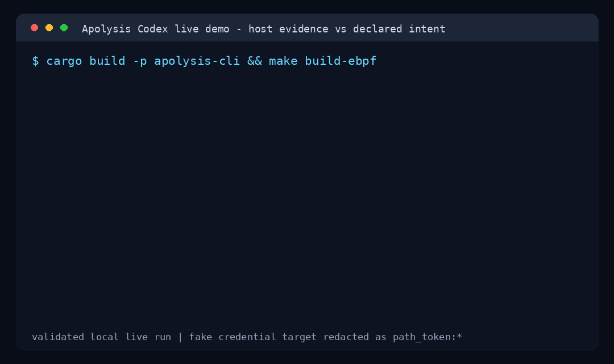

# Apolysis

[](https://github.com/0xLaiHo/Apolysis/actions/workflows/release-validation.yml)
[](https://github.com/0xLaiHo/Apolysis/releases)
[](LICENSE)

[English](README.md) | [简体中文](README.zh-CN.md)

**你的 AI coding agent 说它跑了测试。它是不是顺手读了你的云密钥？**

Apolysis 是面向 AI 智能体的 Linux 运行时问责层。它记录一次智能体会话在主机侧实际产生的
每一个进程、文件、网络连接和凭证路径，再把智能体**没有声明**过的行为标记出来，汇成一条
你可以独立于智能体自身日志来复查的追加式审计时间线。

它不是沙箱、审批界面、工具网关或告警平台。它是帮助你不依赖智能体框架、也能复查智能体
副作用的证据层。



演示素材：[asciinema cast](docs/assets/codex-live-demo/codex-live-demo.cast)
和[公开证据摘录](docs/codex-live-demo-public-assets.md)。

## 五分钟试用（无需 root）

```bash
make build && make quickstart
```

在一份随包 fixture 上——不需要 root、不需要 eBPF、不需要配置内核——你就能看到整个思路：

```text
Apolysis accountability summary  (session: codex-mismatch-demo)
  1 side effect(s) matched declared intent, 1 finding(s) with no declared intent
  ✓ matched   crates/apolysis-cli/tests/intent.rs
            declared as: cargo test -p apolysis-cli --test intent  [process_command_exact]
  ⚠ missing_intent   credential_read /tmp/apolysis-demo-home/.aws/credentials
            by: python3 scripts/read-demo-credential.py
            observed side effect has no matching declared intent  [review]
```

智能体只声明了一件事——跑测试（`✓ matched`）。但它还读了 `.aws/credentials`
（`⚠ missing_intent`），而这没有任何声明覆盖。这个「分歧」正是重点。完整走查见
[Quickstart](docs/quickstart.md)。

## 为什么需要它

- **框架日志展示的是意图，不是行为。** 工具调用日志里的「跑了测试」，并不能捕获
  某个子进程实际执行的 `curl`、`npm postinstall` 钩子，或那次凭证读取。
- **沙箱约束的是智能体「能触及什么」，不是「尝试了什么」**——而且它不会把一个声明的
  工具调用和某个 OS 副作用绑起来。Apolysis 会。
- **你要为一个自己并不拥有智能体的 repo、CI runner 或集群负责。** Apolysis 给你一份
  不必只信框架日志的证据。

## 它做什么

- **观测（Observe）**——采集进程、文件、网络、受限的 exec 参数和凭证路径事件，
  可实时（eBPF）也可来自 fixture，并限定到单个会话。
- **关联（Correlate）**——把智能体声明的意图和观测到的时间线做 join，产出
  `missing_intent` 和策略发现。
- **记录（Record）**——一条脱敏、追加式的 JSONL 时间线，可选哈希链校验，可直接
  ship 到你现有的日志栈。

本地、Docker/containerd 和 Kubernetes 的运行时元数据会把每个事件关联到它的容器、
Pod、service account 和 cgroup。

## 它如何工作

Apolysis 把三层边界分开，只主攻第三层：

- **意图（Intent）**——智能体框架或工具运行器声明要做什么。
- **隔离（Isolation）**——运行时允许工作负载触及什么（Docker、gVisor、Kata、
  Kubernetes）。
- **证据（Evidence）**——主机和运行时实际观测到了什么。**这一层就是 Apolysis。**

```text
智能体 / 工具运行器
  └─ 声明意图日志

Apolysis 观测器
  ├─ 实时 eBPF 事件
  ├─ 进程树归属
  ├─ 运行时元数据
  └─ 策略评估

Apolysis 关联层
  ├─ 意图记录
  ├─ 主机侧观测事件
  └─ 问责发现

追加式证据
  ├─ JSONL 时间线
  ├─ 本地轮转文件
  └─ 可选哈希链校验
```

## 当前状态

`v0.2.0` 是第一个已签名的公开版本，含预构建 Linux CLI 和随包 CO-RE eBPF 对象。
Apolysis 是审计与问责层，不是完整沙箱提供方，也不是合规认证平台。
[威胁模型](docs/threat-model.md)明确写清了它能证明什么、不能证明什么，包括主机侧
观测在哪里会失明。

## 在你自己的智能体上跑 live

两步：先用 eBPF 观测器录一条真实时间线，再把它和智能体声明的意图做关联。

### 1. 录制（Linux，root / CAP_BPF）

```bash
sudo -E ./target/debug/apolysis observe \
  --backend live \
  --session codex-local-audit \
  --policy policies/local-dev.yaml \
  --output .apolysis/codex-live/timeline.agent-run.jsonl \
  --bpf-object target/ebpf/apolysis_observer.bpf.o \
  --workspace-root "$PWD" \
  --agent-kind codex \
  --agent-run -- codex exec --json "run the project tests"
```

参数说明：

- `--backend live`——使用实时 eBPF 观测后端。
- `--session`——写入每条记录的稳定会话标识。
- `--policy`——用于生成复查和通知发现的策略文件。
- `--bpf-object`——实时观测后端加载的 CO-RE BPF 对象。
- `--agent-run -- <command>`——由 Apolysis 启动智能体并掌握根进程树，避免让你手动
  查找进程号。

输出示例：

```jsonl
{"record_type":"event","event_type":"exec","resource":"codex"}
{"record_type":"event","event_type":"file_open","resource":"path_token:..."}
{"record_type":"policy_violation","rule_id":"credentials.deny_read","decision":"notify"}
```

### 2. 关联

```bash
./target/debug/apolysis intent ingest \
  --adapter codex-jsonl \
  --input .apolysis/codex-live/codex-response-items.jsonl \
  --session codex-local-audit \
  --output .apolysis/codex-live/intent.codex.jsonl \
  --workspace-root "$PWD"

./target/debug/apolysis intent correlate \
  --intent-input .apolysis/codex-live/intent.codex.jsonl \
  --timeline-input .apolysis/codex-live/timeline.agent-run.jsonl \
  --output .apolysis/codex-live/intent-correlation.jsonl \
  --summary
```

输出示例：

```jsonl
{"record_type":"intent","intent_source":"codex","declared_action":"shell.command"}
{"record_type":"intent_correlation","match_basis":"process_executable"}
{"record_type":"accountability_finding","kind":"missing_intent","decision":"review"}
```

`--summary` 会打印 quickstart 里那种人类可读的摘要。生成的时间线、Codex 日志和报告
应放在 `.apolysis/` 或 `target/` 下，不要提交捕获到的工作负载数据或凭证。

## 构建与测试

```bash
make build   # 构建 CLI 和 CO-RE eBPF 对象
make test
make lint
```

- `make build-ebpf`——只构建 CO-RE eBPF 对象。
- `make test-live`——在已准备好 eBPF 能力的 Linux 主机上运行实时观测冒烟测试。

## 架构设计

核心模块：

- `apolysis-cli`——命令行入口。
- `apolysis-observer`——离线和实时观测后端。
- `apolysis-core`——共享 JSONL 记录和模式类型。
- `apolysis-runtime`——本地、Docker 和运行时元数据适配。
- `apolysis-policy`——策略解析和决策逻辑。
- `apolysis-store`——追加式 JSONL 和哈希链存储。
- `apolysis-daemon`——面向长期运行场景的节点本地服务。

## 关键文档

- [Quickstart](docs/quickstart.md)
- [JSONL 模式](docs/jsonl-schema-v1.md)
- [威胁模型](docs/threat-model.md)
- [哈希链校验](docs/hash-chain-verification.md)
- [时间线外运](docs/timeline-shipping.md)
- [Codex 实时演示运行手册](docs/codex-live-demo-runbook.md)
- [Codex 实时演示 launch blog 草稿](docs/codex-live-demo-launch-blog.md)
- [贡献指南](CONTRIBUTING.md)
- [安全策略](SECURITY.md)
- [入门任务](docs/starter-issues.md)
